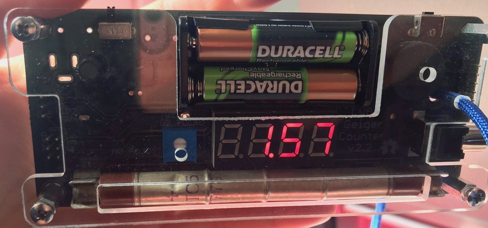

# LVA Geiger Client v0.1.1



* **v1.0**
	* Initial setup of Tkinter and PySerial libs
	* Select COM Port interface and Serial Port logs
	* COM Port status

# Installation

* Install Python v3 (not v2.7!)
* Install [PySerial](http://pyserial.readthedocs.io/en/latest/pyserial.html#installation)
```
  pip3 install pyserial
```

# Usage

```
  python3 geiger.py
```

# Links

[GitHub](https://github.com/anrieff/geiger-counter) Geiger Counter firmware
